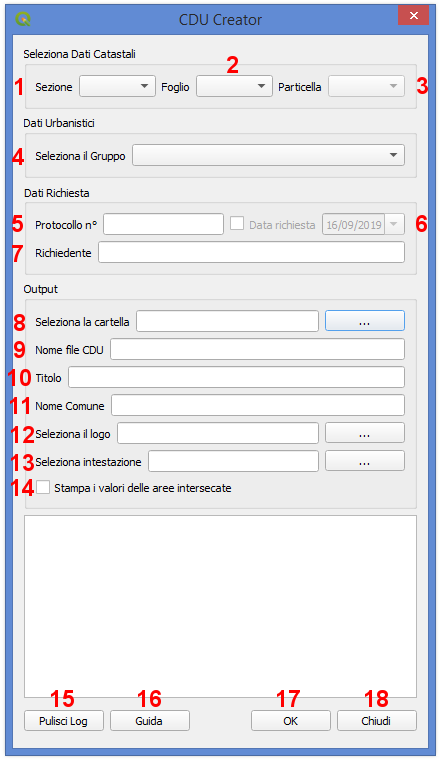

Il Plugin CDU Creator
==================================
Il **Plugin CDU Creator** genera automaticamente il Certificato di Destinazione Urbanistica (CDU) a partire dal layer vettoriale dei terreni catastali e dai layers vettoriali dello strumento urbanistico vigente (PUC, PRG, ecc.). L'output finale è un file .pdf contenete tutte le informazioni relative allo strumento urbanistico recuperate dalle tabelle degli attributi dei layers che si intersecano con la particella catastale selezionata dall'utente.

I principali input del Plugin CDU Creator sono i dati dei terreni catastali, che devono essere caricati all'interno di un progetto QGIS come layer vettoriale poligonale, e i dati relativi allo strumento urbanistico vigente anch'essi da caricare nel progetto QGIS come layer vettoriali poligonali. Per il corretto funzionamento del Plugin, il layer dei terreni catastali decve essere obbligatoriamente nominato **terreni_catastali**, mentre i layers dello strumento urbanistico dovranno essere organizzati in gruppi e sottogruppi (n.b. per la corretta organizzazione dei dati al fine di consentire il corretto funzionamento del plugin, si rimanda al paragrafo seguente).

Preparazione dei Dati
--------------------------------------------

Graphical User Interface
--------------------------------------------

* **1 - 
* **2 - 
* **3 - 

Example
--------------------------------------------

