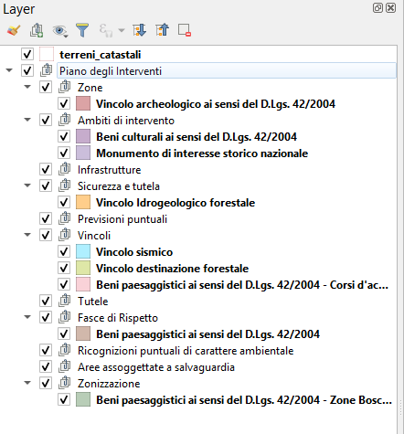
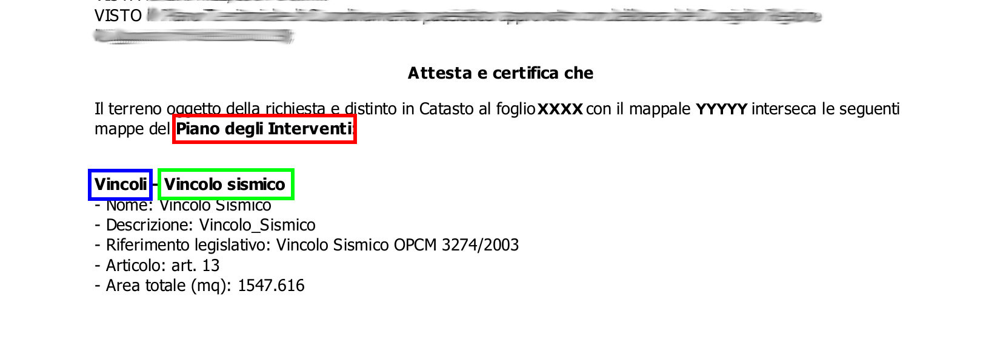
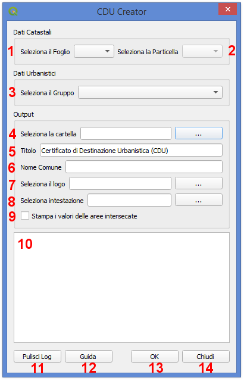

Il Plugin CDU Creator
==================================
Il **Plugin CDU Creator** genera automaticamente il Certificato di Destinazione Urbanistica (CDU) a partire dal layer vettoriale dei terreni catastali e dai layers vettoriali dello strumento urbanistico vigente (PUC, PRG, ecc.). L'output finale è un file .pdf contenete tutte le informazioni relative allo strumento urbanistico recuperate dalle tabelle degli attributi dei layers che si intersecano con la particella catastale selezionata dall'utente.

I principali input del Plugin CDU Creator sono i dati dei terreni catastali, che devono essere caricati all'interno di un progetto QGIS come layer vettoriale poligonale, e i dati relativi allo strumento urbanistico vigente anch'essi da caricare nel progetto QGIS come layer vettoriali poligonali. Per il corretto funzionamento del Plugin, il layer dei terreni catastali decve essere obbligatoriamente nominato **terreni_catastali**, mentre i layers dello strumento urbanistico dovranno essere organizzati in gruppi e sottogruppi (n.b. per la corretta organizzazione dei dati al fine di consentire il corretto funzionamento del plugin, si rimanda al paragrafo  :ref:`preparazione-dati`)

Il Plugin compila il CDU per la particella catastale selezionata nel layer **terreni_catastali**. L'utente può selezionare la particella con i comuni strumentio di selezione di QGIS oppure utilizzando l'interfaccia grafica del plugin, selezionando prima il foglio dal menù a tendina e quindi il numero della particella dal relativo menù a tendina. Qualora l'utente selezioni una particella con gli strumenti di selezione di QGIS e anche tramite i menù dell'interfaccia grafica, il CDU verrà compilato per la particella selezionata tramite l'interfaccia grafica del plugin.
**N.B.:** il plugin CDU Creator compila il CDU per una singola particella. Qualora si voglia compilare il CDU per più particelle, il plugin dovrà essere lanciato per ciascuna di esse modificando di volta in volta la selezione della particella.

Come già anticipato nell'introduzione di questo manuale, l'output finale del plugin è un file .pdf contenete le informazioni necessarie per la creazione del CDU. Il file .pdf può essere personalizzato aggiungendo ad esempio un titolo, un logo e una sezione testuale semplicemente inserendo il testo che dovrà comparire come titolo, selezionando un file .png da usare come logo e un file .txt per la sezione testuale. Questi elementi devono essere definiti tramite l'interfaccia grafica (si veda il pragrafo :ref:`graphical-user-interface` per maggiori dettagli). Una volta indicati il titolo, il file del logo e il file della sezione testuale, queste informazioni insieme al percorso alla cartella dove dovrà essere salvato il file del CDU saranno memorizzate e quindi riproposte al successivo avvio del plugin. Qulora si volessero modificare queste impostazioni, sarà sufficente selezionare nuovi file o modificare il titolo o eventualmente rimuoverli e la nuova configurazione sarà riproposta al successivo avvio del plugin.

Gli input obbligatori del Plugin **CDU Creator** sono:
* una particella selezionata nel layer *terreni_catastali*;
* un gruppo contenente i layers dello strumento urbanistico;
* il percorso a una cartella di output in cui salvare il file .pdf del CDU

Il pdf finale del CDU sarà quindi salvato nella cartella indicata dall'utente e sarà automaticamente nominato con la seguente nomenclatura: **CDU_Fxxx_Myyy_ggmmaaaa_hhmmss.pdf** ovvero verranno indicati il numero del foglio e del mappale selezionato e la data e l'ora di creazione del file.

.. _preparazione-dati:

Preparazione dei Dati
--------------------------------------------
Per il corretto funzionamento del Plugin **CDU Creator** è ncessario preparare e organizzare i dati all'interno del progetto QGIS in modo appropriato.

In generale, sia il layer dei terreni catastali sia i layers dello strumento urbanistico devono essere layer vettoriali poligonali (shapefile, GeoPackage, tabella PostGIS, ecc.). Il primo deve essere necessariamente nominato **terreni_catastali** altrimenti il plugin restituirà un messaggio di errore all'avvio segnalando appunto la mancanza di un layer nominato *terreni_catastali* all'interno del progetto QGIS. I layers dello strumento urbanistico invece, devono essere necessariamente inseriti all'interno di un gruppo nel quale NON deve essere inserito invece il layer *terreni_catastali*.

Layer Terreni Catastali
+++++++++++++++++++++++
Come già detto, il layer contenente le geometrie poligonali delle particelle catastali deve essere nominato **terreni_catastali** e deve essere caricato nel progetto QGIS senza inserirlo in alcun gruppo di layer. Non è necessario che il file dei terreni sia nominato *terreni_catastali* ma è sufficiente che sia rinominato il layer una volta caricato il file nel progetto QGIS (es. il file catasto.shp genera un layer 'catasto' una volta caricato nel progetto QGIS, rinominando il layer in *terreni_catastali* il plugin funzionerà in modo corretto senza dover modificare il nome del file).

Il layer *terreni_catastali* deve necessariamente contenere nella relativa tabella degli attributi almeno due colonne entrambe di **tipo testo**, una in cui deve essere indicato il numero di foglio catastale e una in cui deve essere indicato il numero del mappale delle singole particelle. La colonna contenente il numero di foglio catastale deve avere **nome o alias** = **foglio** (sia il nome che l'alias sono case insensitive ovvero non influenzati dall'uso di lettere maiuscole/minuscole --> è possibile scrivere foglio, FOGLIO, Foglio, fOgLiO, ecc.). La colonna contenente il numero di mappale deve avere **nome o alias** = **mappale** (anche in questo caso, sia il nome che l'alias sono case insensitive ovvero non influenzati dall'uso di lettere maiuscole/minuscole --> è possibile scrivere mappale, MAPPALE, Mappale, MaPpAlE, ecc.).

Layers Strumento Urbanistico
++++++++++++++++++++++++++++
Per quanto riguarda i layers che compongono lo strumento urbanistico, questi devono essere organizzati in gruppi e sottogruppi a seconda della complessità dello strumento stesso. Ad esempio, il PRG di un piccolo Comune composto da pochi layers può essere facilmente organizzato in un soingolo gruppo, mentre il PUC di un grande Comune potrebbe essere organizzato appunto in un gruppo suddiviso in sottogruppi come mostrato nell'immagine sotto.

In ogni caso i layers dello strumento urbanistico devono **necessariamente essere inseriti in un gruppo**, la siddivisione del gruppo in sottogruppi invece è facoltativa.

Gruppo, sottogruppi e layers possono essere nominati liberamente, si consiglia comunque di nominare i vari elementi in modo appropriato dal momento che sia il nome del gruppo che quello dei sottogruppi e layers compariranno nel CDU finale generato dal plugin, come mostrato nello stralcio nell'immagine sotto dove in rosso è indicato il nome del Gruppo, in blu il nome del sottogruppo e in verde il nome del layer.

Come già anticipato nell'introduzione di questo manuale, nel CDU vengono stampate le informazioni relative alle diverese aree dello strumento urbanistico che intersecano la particella selezionata. Queste informazioni vengono automaticamente recuperate dalle tabelle degli attributi dei diversi layers dello strumento urbanistico. Per questo motivo, anche la tabelle dei layers dello strumento urbanistico devono essere organizzate in modo tale da consentire il corretto funzionamento del plugin. Il Plugin si aspetta di trovare nelle tabelle degli attributi relative ai singoli layers dello strumento urbanistico una colonna contenete il nome dell'area, una contenente la descrizione, una contenete eventuali riferimenti legislativi ad altre norme e una contenente l'articolo della normativa relativa allo strumento urbanistico. 
* La colonna contenete il nome dell'area deve essere di **tipo testo** e deve avere **nome o alias** = **nome** (sia il nome che l'alias sono case insensitive ovvero non influenzati dall'uso di lettere maiuscole/minuscole --> è possibile scrivere nome, NOME, Nome, NoMe, ecc.). Questa colonna non è obbligatoria, se il plugin non trova un colonna nominata o con alias = *nome* semplicemente segnalerà con un messaggio di warning che la colonna non è stata trovata nel relativo layer e quindi non stamperà alcun valore nella riga corrispondente del CDU. Qualora invece esistesse una colonna con *nome o alias* = *nome* nella tabella degli attributi, sono ovviamente ammessi eventuali valori nulli; anche in questo caso il plugin non stamperà alcun valore nella riga corrispondente del CDU.
* La colonna contenete la descrizione deve essere di **tipo testo** e deve avere **nome o alias** = **descrizione** (sia il nome che l'alias sono case insensitive ovvero non influenzati dall'uso di lettere maiuscole/minuscole --> è possibile scrivere descrizione, DESCRIZIONE, Descrizione, DesCRizIOne, ecc.). Questa colonna non è obbligatoria, se il plugin non trova un colonna nominata o con alias = *descrizione* semplicemente segnalerà con un messaggio di warning che la colonna non è stata trovata nel relativo layer e quindi non stamperà alcun valore nella riga corrispondente del CDU. Qualora invece esistesse una colonna con *nome o alias* = *descrizione* nella tabella degli attributi, sono ovviamente ammessi eventuali valori nulli; anche in questo caso il plugin non stamperà alcun valore nella riga corrispondente del CDU.
* La colonna contenete il riferimento legislativo deve essere di **tipo testo** e deve avere **nome o alias** = **riferimento legislativo** (sia il nome che l'alias sono case insensitive ovvero non influenzati dall'uso di lettere maiuscole/minuscole --> è possibile scrivere riferimento legislativo, RIFERIMENTO LEGISLATIVO, Riferimento Legislativo, ecc.). Questa colonna non è obbligatoria, se il plugin non trova un colonna nominata o con alias = *nome* semplicemente segnalerà con un messaggio di warning che la colonna non è stata trovata nel relativo layer e quindi non stamperà alcun valore nella riga corrispondente del CDU. Qualora invece esistesse una colonna con *nome o alias* = *riferimento legislativo* nella tabella degli attributi, sono ovviamente ammessi eventuali valori nulli; anche in questo caso il plugin non stamperà alcun valore nella riga corrispondente del CDU.
* La colonna contenete l'articolo della normativa urbanistica deve essere di **tipo testo** e deve avere **nome o alias** = **articolo** (sia il nome che l'alias sono case insensitive ovvero non influenzati dall'uso di lettere maiuscole/minuscole --> è possibile scrivere articolo, ARTICOLO, Articolo, ArTiCoLo, ecc.). Questa colonna non è obbligatoria, se il plugin non trova un colonna nominata o con alias = *articolo* semplicemente segnalerà con un messaggio di warning che la colonna non è stata trovata nel relativo layer e quindi non stamperà alcun valore nella riga corrispondente del CDU. Qualora invece esistesse una colonna con *nome o alias* = *articolo* nella tabella degli attributi, sono ovviamente ammessi eventuali valori nulli; anche in questo caso il plugin non stamperà alcun valore nella riga corrispondente del CDU.

.. spiegare testo HTML nelle colonne

.. _graphical-user-interface:

Graphical User Interface
--------------------------------------------

* **1 - 
* **2 - 
* **3 - 

Example
--------------------------------------------

