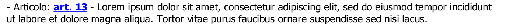
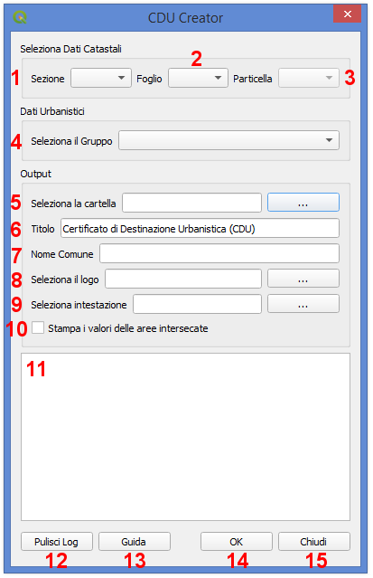

Il Plugin CDU Creator
==================================
Il **Plugin CDU Creator** genera automaticamente il Certificato di Destinazione Urbanistica (CDU) a partire dal layer vettoriale dei terreni catastali e dai layers vettoriali dello strumento urbanistico vigente (PUC, PRG, ecc.). L'output finale è un file .pdf contenete tutte le informazioni relative allo strumento urbanistico recuperate dalle tabelle degli attributi dei layers che si intersecano con la particella catastale selezionata dall'utente.

I principali input del Plugin CDU Creator sono i dati dei terreni catastali, che devono essere caricati all'interno di un progetto QGIS come layer vettoriale poligonale, e i dati relativi allo strumento urbanistico vigente anch'essi da caricare nel progetto QGIS come layer vettoriali poligonali. Per il corretto funzionamento del Plugin, il layer dei terreni catastali deve essere obbligatoriamente nominato **terreni_catastali**, mentre i layers dello strumento urbanistico dovranno essere organizzati in gruppi e sottogruppi (n.b. per la corretta organizzazione dei dati al fine di consentire il corretto funzionamento del plugin, si rimanda al paragrafo  :ref:`preparazione-dati`)

Il Plugin compila il CDU per la particella catastale selezionata nel layer **terreni_catastali**. L'utente può selezionare la particella con i comuni strumenti di selezione di QGIS oppure utilizzando l'interfaccia grafica del plugin, selezionando l'eventuale sezione dal menù a tendina, il foglio e quindi il numero della particella dai relativi menù a tendina. Qualora l'utente selezioni una particella con gli strumenti di selezione di QGIS e anche tramite i menù dell'interfaccia grafica, il CDU verrà compilato per la particella selezionata tramite l'interfaccia grafica del plugin.

**N.B.:** il plugin CDU Creator compila il CDU per una singola particella. Qualora si voglia compilare il CDU per più particelle, il plugin dovrà essere lanciato per ciascuna di esse modificando di volta in volta la selezione della particella.

Come già anticipato nell'introduzione di questo manuale, l'output finale del plugin è un file .pdf contenete le informazioni necessarie per la creazione del CDU. Il file .pdf può essere personalizzato aggiungendo ad esempio un titolo, un logo e una sezione testuale semplicemente inserendo il testo che dovrà comparire come titolo, selezionando un file .png da usare come logo e un file .txt per la sezione testuale. Questi elementi devono essere definiti tramite l'interfaccia grafica (si veda il pragrafo :ref:`graphical-user-interface` per maggiori dettagli). Una volta indicati il titolo, il file del logo e il file della sezione testuale, queste informazioni insieme al percorso alla cartella dove dovrà essere salvato il file del CDU saranno memorizzate e quindi riproposte al successivo avvio del plugin. Qualora si volessero modificare queste impostazioni, sarà sufficente selezionare nuovi file o modificare il titolo o eventualmente rimuoverli e la nuova configurazione sarà riproposta al successivo avvio del plugin.

Gli input obbligatori del Plugin **CDU Creator** sono:
* una particella selezionata nel layer *terreni_catastali*;
* un gruppo contenente i layers dello strumento urbanistico;
* il percorso a una cartella di output in cui salvare il file .pdf del CDU

Il pdf finale del CDU sarà quindi salvato nella cartella indicata dall'utente e sarà automaticamente nominato con una delle seguenti nomenclatura a seconda che sia stato definito nell'interfaccia grafica o comunque nella tabella degli attributi del layer terreni catastali un valore per la sezione:

* **CDU_S_xxxx_Fyyy_Mzzz_ggmmaaaa_hhmmss.pdf** - verranno indicati il valore della sezione, il numero del foglio e del mappale selezionato e la data e l'ora di creazione del file. 
* **CDU_Fxxx_Myyy_ggmmaaaa_hhmmss.pdf** - verranno indicati il numero del foglio e del mappale selezionato e la data e l'ora di creazione del file. 

.. _preparazione-dati:

Preparazione dei Dati
--------------------------------------------
Per il corretto funzionamento del Plugin **CDU Creator** è ncessario preparare e organizzare i dati all'interno del progetto QGIS in modo appropriato.

In generale, sia il layer dei terreni catastali sia i layers dello strumento urbanistico devono essere layer vettoriali poligonali (shapefile, GeoPackage, tabella PostGIS, ecc.). Il primo deve essere necessariamente nominato **terreni_catastali** altrimenti il plugin restituirà un messaggio di errore all'avvio segnalando appunto la mancanza di un layer nominato *terreni_catastali* all'interno del progetto QGIS. I layers dello strumento urbanistico invece, devono essere necessariamente inseriti all'interno di un gruppo nel quale NON deve essere inserito invece il layer *terreni_catastali*.

Layer Terreni Catastali
+++++++++++++++++++++++
Come già detto, il layer contenente le geometrie poligonali delle particelle catastali deve essere nominato **terreni_catastali** e deve essere caricato nel progetto QGIS senza inserirlo in alcun gruppo di layer. Non è necessario che il file dei terreni sia nominato *terreni_catastali* ma è sufficiente che sia rinominato il layer una volta caricato il file nel progetto QGIS (es. il file catasto.shp genera un layer 'catasto' una volta caricato nel progetto QGIS, rinominando il layer in *terreni_catastali* il plugin funzionerà in modo corretto senza dover modificare il nome del file). 

**NB.** Il layer dei terreni_catastali deve contenere le particella appartenenti a un singolo comune per evitare ambiguità nella selezione della particella tramite l'interfaccia grafica.

Il layer *terreni_catastali* deve necessariamente contenere nella relativa tabella degli attributi almeno tre colonne di **tipo testo**, una in cui deve essere indicato il valore della sezione, una in cui deve essere indicato il numero di foglio catastale e una in cui deve essere indicato il numero del mappale delle singole particelle. La colonna contenete la sezione può eventualmente essere lasciata vuota qualora il catasto non sia suddiviso in sezioni (NB. la colonna deve comunque essere creata, può essere vuota ma comunque deve esistere). La colonna contenente il valore della sezione catastale deve avere **nome o alias** = **sezione** (sia il nome che l'alias sono case insensitive ovvero non influenzati dall'uso di lettere maiuscole/minuscole --> è possibile scrivere sezione, SEZIONE, Sezione, SeZiOnE, ecc.). La colonna contenente il numero di foglio catastale deve avere **nome o alias** = **foglio** (sia il nome che l'alias sono case insensitive ovvero non influenzati dall'uso di lettere maiuscole/minuscole --> è possibile scrivere foglio, FOGLIO, Foglio, fOgLiO, ecc.). La colonna contenente il numero di mappale deve avere **nome o alias** = **mappale** (anche in questo caso, sia il nome che l'alias sono case insensitive ovvero non influenzati dall'uso di lettere maiuscole/minuscole --> è possibile scrivere mappale, MAPPALE, Mappale, MaPpAlE, ecc.).

Gruppo Layers Strumento Urbanistico
++++++++++++++++++++++++++++
Per quanto riguarda i layers che compongono lo strumento urbanistico, questi devono essere organizzati in gruppi e sottogruppi a seconda della complessità dello strumento stesso. Ad esempio, il PRG di un piccolo Comune composto da pochi layers può essere facilmente organizzato in un soingolo gruppo, mentre il PUC di un grande Comune potrebbe essere organizzato appunto in un gruppo suddiviso in sottogruppi come mostrato nell'immagine sotto.

.. image:: img/layer_tree.png

In ogni caso i layers dello strumento urbanistico devono **necessariamente essere inseriti in un gruppo**, la siddivisione del gruppo in sottogruppi invece è facoltativa.

Gruppo, sottogruppi e layers possono essere nominati liberamente, si consiglia comunque di nominare i vari elementi in modo appropriato dal momento che sia il nome del gruppo che quello dei sottogruppi e layers compariranno nel CDU finale generato dal plugin, come mostrato nello stralcio nell'immagine sotto dove in rosso è indicato il nome del Gruppo, in blu il nome del sottogruppo e in verde il nome del layer.

.. image:: img/subg_layer2.png

**NB.** Le geometrie poligonali dei layers dello strumento urbanistico devono essere **geometrie valide e topologicamente corrette** altrimenti c'è la possibilità che il Plugin restituisca un messaggio di errore e che quindi il CDU non venga creato.

Come già anticipato nell'introduzione di questo manuale, nel CDU vengono stampate le informazioni relative alle diverese aree dello strumento urbanistico che intersecano la particella selezionata. Queste informazioni vengono automaticamente recuperate dalle tabelle degli attributi dei diversi layers dello strumento urbanistico. Per questo motivo, anche la tabelle dei layers dello strumento urbanistico devono essere organizzate in modo tale da consentire il corretto funzionamento del plugin. Il Plugin si aspetta di trovare nelle tabelle degli attributi relative ai singoli layers dello strumento urbanistico una colonna contenete il nome dell'area, una contenente la descrizione, una contenete eventuali riferimenti legislativi ad altre norme e una contenente l'articolo della normativa relativa allo strumento urbanistico. 

* La colonna contenete il nome dell'area deve essere di **tipo testo** e deve avere **nome o alias** = **nome** (sia il nome che l'alias sono case insensitive ovvero non influenzati dall'uso di lettere maiuscole/minuscole --> è possibile scrivere nome, NOME, Nome, NoMe, ecc.). Questa colonna non è obbligatoria, se il plugin non trova un colonna nominata o con alias = *nome* semplicemente segnalerà con un messaggio di warning che la colonna non è stata trovata nel relativo layer e quindi non stamperà alcun valore nella riga corrispondente del CDU. Qualora invece esistesse una colonna con *nome o alias* = *nome* nella tabella degli attributi, sono ovviamente ammessi eventuali valori nulli; anche in questo caso il plugin non stamperà alcun valore nella riga corrispondente del CDU.

* La colonna contenete la descrizione deve essere di **tipo testo** e deve avere **nome o alias** = **descrizione** (sia il nome che l'alias sono case insensitive ovvero non influenzati dall'uso di lettere maiuscole/minuscole --> è possibile scrivere descrizione, DESCRIZIONE, Descrizione, DesCRizIOne, ecc.). Questa colonna non è obbligatoria, se il plugin non trova un colonna nominata o con alias = *descrizione* semplicemente segnalerà con un messaggio di warning che la colonna non è stata trovata nel relativo layer e quindi non stamperà alcun valore nella riga corrispondente del CDU. Qualora invece esistesse una colonna con *nome o alias* = *descrizione* nella tabella degli attributi, sono ovviamente ammessi eventuali valori nulli; anche in questo caso il plugin non stamperà alcun valore nella riga corrispondente del CDU.

* La colonna contenete il riferimento legislativo deve essere di **tipo testo** e deve avere **nome o alias** = **riferimento legislativo** (sia il nome che l'alias sono case insensitive ovvero non influenzati dall'uso di lettere maiuscole/minuscole --> è possibile scrivere riferimento legislativo, RIFERIMENTO LEGISLATIVO, Riferimento Legislativo, ecc.). Questa colonna non è obbligatoria, se il plugin non trova un colonna nominata o con alias = *nome* semplicemente segnalerà con un messaggio di warning che la colonna non è stata trovata nel relativo layer e quindi non stamperà alcun valore nella riga corrispondente del CDU. Qualora invece esistesse una colonna con *nome o alias* = *riferimento legislativo* nella tabella degli attributi, sono ovviamente ammessi eventuali valori nulli; anche in questo caso il plugin non stamperà alcun valore nella riga corrispondente del CDU.

* La colonna contenete l'articolo della normativa urbanistica deve essere di **tipo testo** e deve avere **nome o alias** = **articolo** (sia il nome che l'alias sono case insensitive ovvero non influenzati dall'uso di lettere maiuscole/minuscole --> è possibile scrivere articolo, ARTICOLO, Articolo, ArTiCoLo, ecc.). Questa colonna non è obbligatoria, se il plugin non trova un colonna nominata o con alias = *articolo* semplicemente segnalerà con un messaggio di warning che la colonna non è stata trovata nel relativo layer e quindi non stamperà alcun valore nella riga corrispondente del CDU. Qualora invece esistesse una colonna con *nome o alias* = *articolo* nella tabella degli attributi, sono ovviamente ammessi eventuali valori nulli; anche in questo caso il plugin non stamperà alcun valore nella riga corrispondente del CDU.

All'interno delle colonne il testo può essere formattato come HTML quindi servendosi dei vari <tag> html per dare particolari effetti al testo (es. bold, italic, ecc.), per impaginare il testo con a capo, elenchi ecc. ed eventualmente per aggiungere link a pagine web nel testo. In particolar modo la possibilità di formattare il testo come HTML può essere molto utile soprattutto per rendere più facilmente leggibile il contenuto della colonna *articolo*. Qui infatti può essere inserito l'intero testo dell'articolo di riferimento della normativa (attenzione al limite di caratteri possibili soprattutto nel caso in cui vengano usati degli Shapefile) oppure, qualora la normativa fosse disponibile su una pagina web, inserire tramite l'utilizzo di HTML un link alla pagina puntando direttamente al testo dell'articolo. Il link verrà ovviamente stampato nel file pdf del CDU e da lì sarà possibile cliccare e essere automaticamente reindirizzati alla pagine web della normativa.

Ad esempio le righe sotto verranno stampate come mostrato nell'immagine seguente

.. code-block:: html

  <b><a href="https://www.gter.it/">art. 13</a></b> - Lorem ipsum dolor sit amet, consectetur adipiscing elit, sed do eiusmod tempor incididunt ut labore et dolore magna aliqua. Tortor vitae purus faucibus ornare suspendisse sed nisi lacus.

.. _graphical-user-interface:

L'Interfaccia Grafica
--------------------------------------------
Tutti parametri in input possono essere specificati dall’utente attraverso l’interfaccia grafica del Plugin **CDU Creator** che si apre cliccando sull’icona del plugin nella toolbar.

**NB.** a seconda della dimensione e del numero di geometrie del layer *terreni_catastali*, l'avvio dell'interfaccia grafica del Plugin CDU Creator potrebbe richiedere qualche istante in più del normale.

* **1 - Sezione:** il menù a tendina elenca tutti i valori univoci presenti nella colonna *sezione*. Da qui è possibile selezionare il valore della sezione relativo alla particella per cui si vuole compilare il CDU. No è obbligatorio selezionare la sezione soprattutto se il proprio catasto non è suddiviso in sezioni e quindi la colonna è vuota o comunemente riempita con un trattino '-'. Se presenti nella colonna, sia il valore NULL che l'eventuale '-' compariranno nel menù a tendina ma, come già detto non è necessario selezionarli. Il plugin infatti gestirà autonomamente il valore della sezione se non selezionato tramite il menù a tendina. 
* **2 - Foglio:** il menù a tendina elenca tutti i valori univoci presenti nella colonna *foglio*. Qualora fosse stata precedentemente selezionata una sezione, il menù elencherà tutti i valori univoci della colonna foglio filtrati per il valore di sezione selezionato. Da qui è quindi possibile selezionare il numero di foglio relativo alla particella di cui si vuole compilare il CDU. La selezione del foglio è obbligatoria per poter abilitare il menù a tendina della particella, se non viene selezionato un numero di foglio infatti il menù particella sarà disabilitato.
* **3 - Particella:** il menù a tendina elenca tutti i valori univoci presenti nella colonna *particella* filtrati per il numero di foglio selezionato in precedenza. Da qui è quindi possibile selezionare il numero di particella di cui si vuole compilare il CDU.
* **4 - Seleziona il Gruppo:** da qui è possibile selezionare il gruppo di layers contenente appunto i layers dello strumento urbanistico che si vuole utilixxare per la compilazione del CDU. Il menù a tendina elenca tutti i gruppi di layers presenti all’interno del progetto corrente.
* **5 - Seleziona la cartella:** premendo sul bottone (…) si aprirà una finestra di dialogo tipo esplora risorse da cui sarà possibile navigare all’interno della propria macchina e selezionare la cartella dentro cui si desidera salvare l'output finale del processo (file .pdf del CDU). Una volta selezionata la cartella il percorso a questa comparirà nella stringa di testo accanto al bottone. NB: qualora l’utente non selezionasse una cartella di output, il plugin restituirà un messaggio di errore, il processo verrà bloccato e l’utente avrà la possibilità di selezionare la cartella e successivamente rilanciare il calcolo. Come già detto, la cartella di output è uno dei  parametri che verrà memorizzato e quindi riproposto al successivo avvio del plugin. Qualora si volesse modificare, sarà sufficente selezionare una nuova cartella utilizzando il bottone (...) e il nuovo percorso alla cartella di output sarà memorizzato.
* **6 - Titolo:** si tratta appunto del titolo che comparirà nel file CDU. Di default il titolo è 'Certificato di Destinazione Urbanistica (CDU)' ma è sufficiente digitare il titolo che si desidera nel form di testo. Come già detto, il titolo è uno dei  parametri che verrà memorizzato e quindi riproposto al successivo avvio del plugin. Qualora si volesse modificare, sarà sufficente cambiare il testo e il nuovo titolo sarà memorizzato. Il titolo non è un parametro obbligatorio.
* **7 - Nome Comune:** si tratta appunto del nome del Comune che comparirà nel file CDU. E' sufficiente digitare il nome del Proprio Comune (es. Genova, Piana Crixia, Vicenza, ecc.) nel form di testo. Come già detto, il nome del Comune è uno dei  parametri che verrà memorizzato e quindi riproposto al successivo avvio del plugin. Qualora si volesse modificare, sarà sufficente cambiare il testo e il nuovo nome sarà memorizzato. Il nome Comune non è un parametro obbligatorio.
* **8 - Seleziona il Logo:** premendo sul bottone (…) si aprirà una finestra di dialogo tipo esplora risorse da cui sarà possibile navigare all’interno della propria macchina e selezionare un file *.png* con il logo del proprio Comune o qualsisi immagine si desideri che verrà quindi stampato sopra al titolo nel CDU. Una volta selezionato il file .png il percorso al file comparirà nella stringa di testo accanto al bottone. Come già detto, il logo è uno dei  parametri che verrà memorizzato e quindi riproposto al successivo avvio del plugin. Qualora si volesse modificare, sarà sufficente selezionare un nuovo file .png utilizzando il bottone (...) e il nuovo percorso al file .txt. Qualora invece non si volesse più stampare il logo nel CDU è sufficiente cancellare dal form di testo accanto al bottone il percorso al file. Il logo non è un parametro obbligatorio.
* **9 - Seleziona intestazione:** premendo sul bottone (…) si aprirà una finestra di dialogo tipo esplora risorse da cui sarà possibile navigare all’interno della propria macchina e selezionare un file *.txt* contenente uno testo con eventuali riferimenti legislativi, diciture varie ed eventuali, introduzione al documento, ecc.. Una volta selezionato il file .txt il percorso al file comparirà nella stringa di testo accanto al bottone. Come già detto, l'intestazione è uno dei  parametri che verrà memorizzato e quindi riproposto al successivo avvio del plugin. Qualora si volesse modificare, sarà sufficente selezionare un nuovo file .txt utilizzando il bottone (...) e il nuovo percorso al file .txt sarà memorizzato. Qualora invece non si volesse più stampare l'intestazione nel CDU è sufficiente cancellare dal form di testo accanto al bottone il percorso al file. L'intestazione non è un parametro obbligatorio.
* **10 - Stampa i valori delle aree intersecate:** il plugin calcola l'area (mq) di intersezione fra le singole geometrie di ogni layer dello strumento urbanistico che si intersecano con la particella selezionata. Spuntando la checkbox, l'area verrà quindi stampata nel CDU insieme alle altre informazioni relative allo strumento urbanistico (nome, descrizione, riferimento legislativo, articolo), altrimenti non comparirà.
* **11 - Messaggi di Log:** tutti i messaggi di warning o di errore così come i messaggi informativi sull'andamento del processo compariranno in questa area.
* **12 - Pulisci Log:** il bottone pulisce l’area dei messaggi di Log rimuovendo eventuali messaggi di processi precedenti.
* **13 - Guida:** il bottone apre questo manuale in un web browser.
* **14 - OK:** il bottone lancia il processo. Come già detto, se il plugin restituisce un messaggio di errore il processo viene bloccato e l’utente potrà inserire o modificare i parametri in input, premendo nuovamente il bottone OK il processo verrà rilanciato.
* **15 - Chiudi:** il bottone chiude l’interfaccia grafica del plugin e i parametri in input numero foglio, numero particella e gruppo sono riinizializzati.

Example
--------------------------------------------

